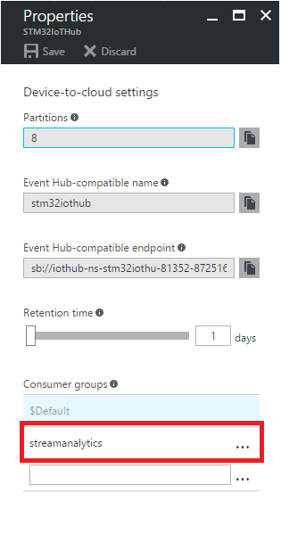
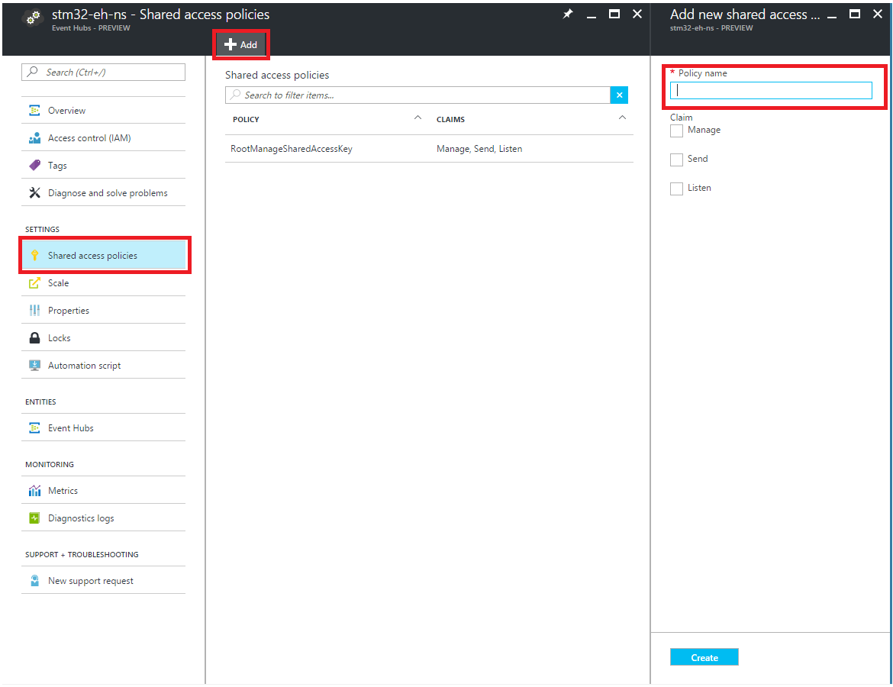
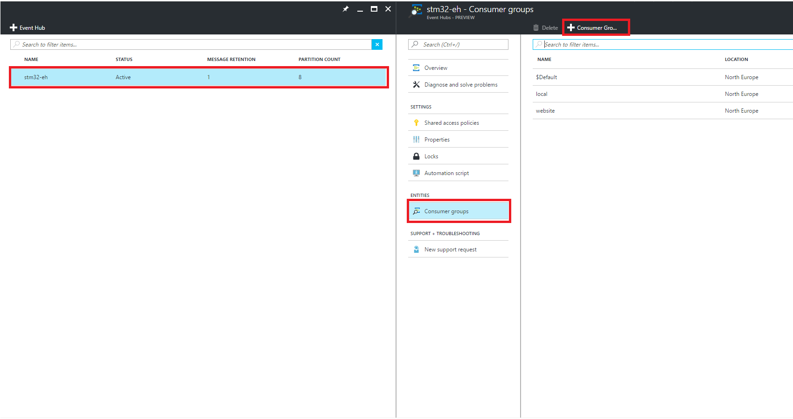
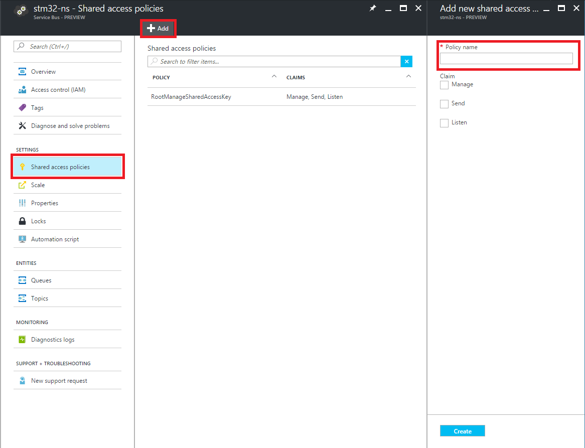

# CLOUD ARCHITECTURE

REQUIREMENTS: you must be logged in your Azure subscription

At the beginning you need to create all the following Azure resources:

* `Azure IotHub` ([official guide](https://docs.microsoft.com/en-us/azure/iot-hub/iot-hub-create-through-portal))
* `Azure StreamAnalytics` ([official guide](https://docs.microsoft.com/en-us/azure/stream-analytics/stream-analytics-create-a-job))
* `Azure WebApp` ([official guide](https://docs.microsoft.com/en-us/azure/app-service-web/app-service-web-how-to-create-a-web-app-in-an-ase))
    * to deploy the *dashboard*
* `Azure ApiApp` ([overview](https://docs.microsoft.com/en-us/azure/app-service-api/app-service-api-apps-why-best-platform) | [example](https://docs.microsoft.com/en-us/azure/app-service-api/app-service-api-dotnet-get-started))
    * to deploy the *registration api*
    * use the same App Service Plan (more info [here](https://docs.microsoft.com/en-us/azure/app-service/app-service-value-prop-what-is)) of the WebApp
* `Azure SQL Database`  ([official guide](https://docs.microsoft.com/en-us/azure/sql-database/sql-database-get-started)
                        | [create more servers](https://github.com/Microsoft/azure-docs/blob/master/articles/sql-database/sql-database-create-servers.md)
                        | [create more dbs](https://github.com/Microsoft/azure-docs/blob/master/articles/sql-database/sql-database-create-databases.md)
                        ) 
* `Azure EventHub` ([official guide](https://docs.microsoft.com/en-us/azure/event-hubs/event-hubs-csharp-ephcs-getstarted))
* `Azure ServiceBus Queue` ([official guide](https://docs.microsoft.com/en-us/azure/service-bus-messaging/service-bus-dotnet-get-started-with-queues#2-create-a-queue-using-the-azure-portal))
    * [here](https://docs.microsoft.com/en-us/azure/service-bus-messaging/service-bus-queues-topics-subscriptions) you can find a service overview


All resources must be in the same subscription and region. 

Now we're going to create the cloud infrastructure connecting our services.

```
ARCHITECTURE IMAGE
```

## 1. Configure IoTHub 
We need to configure the **Messaging Endpoint** Consumer Group.

1. In the Azure portal, open your IoT hub and click on **Endpoints**.
2. Click on **Events** Endpoint.
    
    

3. Add **Consumer Group** for the StreamAnalytics named **streamanalytics**.

    


## 2. Configure EventHub
1. Add Shared Access Policies to the **EventHub's Namespace**
    * Go in the Namespace blade (not the specific Event Hub blade), click **Shared access policies**, and then click **Add**.

        

    * Create one access policy for the **dashboard** with the following features:
        * Name: webapp
        * Permissions: Listen
    
        * Create one access policy for the **StreamAnalytics** with the following features:
        * Name: streamanalytics
        * Permissions: Send

2. Add **Consumer Groups** to the EventHub
    * Go in the Event Hub specific blade, click **Consumer Group**, and then click **+ Consumer Group**.

        

    * Create two Consumer Groups
        * **local** for local testing environment
        * **website** for the production environment

    * You can find more information on Consumer Groups [here](https://docs.microsoft.com/en-us/azure/event-hubs/event-hubs-overview#consumer-groups)

## 3. Configure ServiceBus Queue
We now add Shared Access Policies to the ** ServiceBus Queue's Namespace**
1. Go in the Namespace blade (not the specific Event Hub blade), click **Shared access policies**, and then click **Add**.

    

2. Create one access policy for the **dashboard** with the following features:
    * Name: webjob
    * Permissions: Listen

    * Create one access policy for the **StreamAnalytics** with the following features:
    * Name: streamanalytics
    * Permissions: Send


## 4. Configure SQL Database
Now we're going to create the database structure.
We use EntityFramework as ORM (more info [here](https://msdn.microsoft.com/en-us/library/bb399567.aspx)).

1. Take note of the Database connetion string, [here](https://docs.microsoft.com/en-us/azure/sql-database/sql-database-get-started#view-database-properties-in-the-azure-portal) is explained how to find it in the Azure portal.
2. Open the solution in VisualStudio and open **API** project.
3. Put your connection string in `Web.config` file

    ```
    <add name="Sensor2CloudContext" connectionString="<SQL DB ConnectionString>" providerName="System.Data.SqlClient" />
    ```
    
4. Restore **Nuget packages** of the project 
5. Open **Package Manager Console** in VisualStudio and run `Update-Database` (more info [here](https://www.asp.net/mvc/overview/getting-started/getting-started-with-ef-using-mvc/migrations-and-deployment-with-the-entity-framework-in-an-asp-net-mvc-application))

## 5. Configure StreamAnalytics

```
IMAGE
```

### Input
    * IoTHub (named IoTHubDM)
Images and documentation.

### Output
    * EventHub (named ehOut)
    * ServiceBus Queue (named Queue)
    * SQL Database (named SQL)

### Query
You can find the final query below or [here](../Utilities/StreamAnalyticsQuery.sql).

```sql
-- IoTHubDM -> StreamAnalytics -> Service Bus Queue (Queue)
--                             -> Event Hub (ehOut)
--                             -> SQL Azure (SQL )


WITH NormalizedData AS (
    SELECT IoTHub.ConnectionDeviceId AS id, name, ts, temp, hum, accX, accY, accZ, gyrX, gyrY, gyrZ
    FROM IoTHubDM
)

-- Send messages to web app
-- Every output message is the mean of the messages received in the tumbling window
SELECT id, name, System.Timestamp AS ts, AVG(temp) AS temp, AVG(hum) AS hum, AVG(accX) AS accX, AVG(accY) AS accY, AVG(accZ) AS accZ, AVG(gyrX) AS gyrX, AVG(gyrY) AS gyrY, AVG(gyrZ) AS gyrZ, 'ins' AS mtype
INTO ehOut
FROM NormalizedData PARTITION BY id
GROUP BY id, name, TumblingWindow(second, 2)


-- Count the number of messages sent by each device every day and save it in a SQL database
SELECT IoTHub.ConnectionDeviceId AS MacAddress, System.Timestamp AS Timestamp, COUNT(*) AS MessagesCount
INTO SQL
FROM IoTHubDM
GROUP BY IoTHub.ConnectionDeviceId, TumblingWindow(day, 1)


-- Count the number of messages sent by each device every X minutes and put these info to a message in a queue
-- Those messages will be read by a web job that eventually change the status of every device (enabled/disabled/warning)
-- If you want to put the message only if the number of messages is over a threshold add "HAVING MessagesCount > Y" at the end
SELECT IoTHub.ConnectionDeviceId AS MacAddress, System.Timestamp AS Timestamp, COUNT(*) AS MessagesCount
INTO Queue
FROM IoTHubDM
GROUP BY IoTHub.ConnectionDeviceId, TumblingWindow(second, 60)
```

## 6. Start services
Now we are ready to start the services.

In the Azure portal, open your Azure StreamAnalytics blade and click on **start** ([official guide](https://docs.microsoft.com/en-us/azure/stream-analytics/stream-analytics-run-a-job)).
