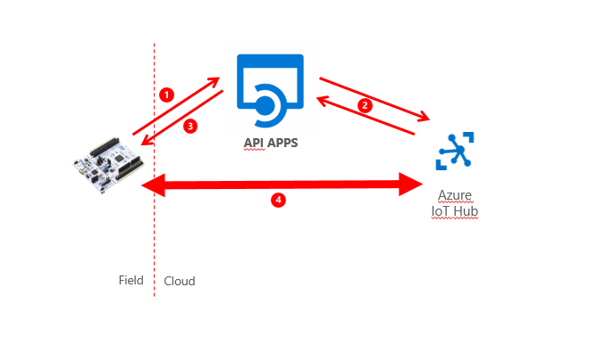
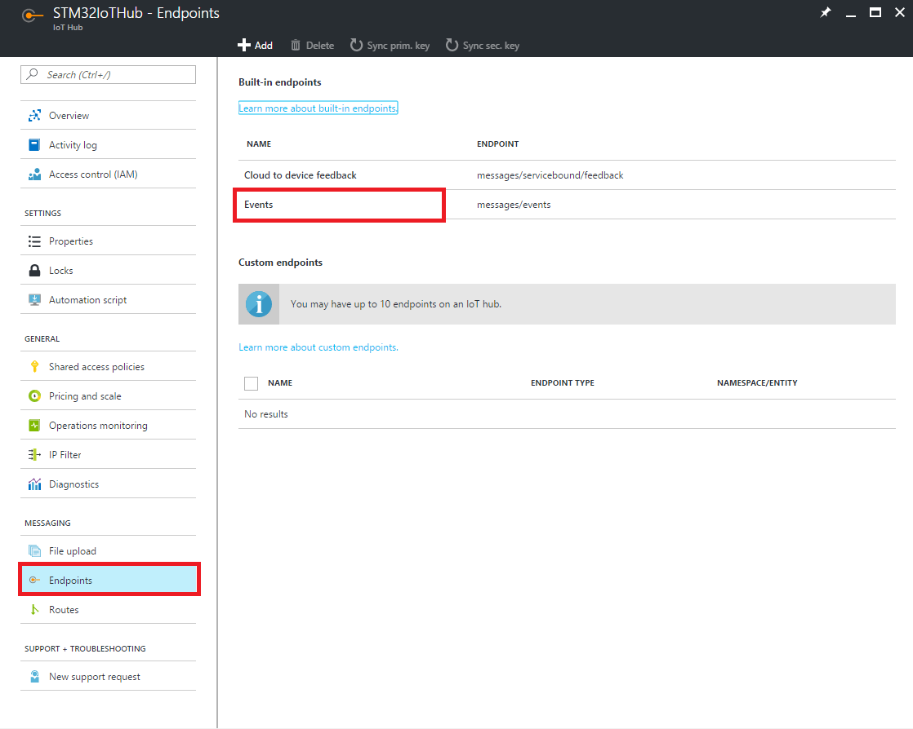
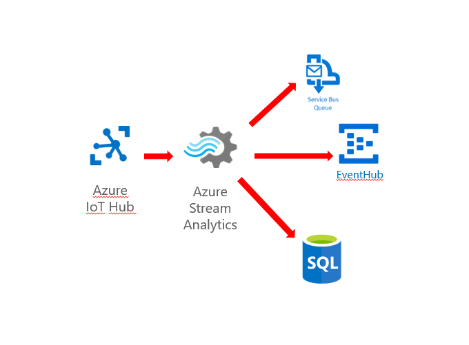
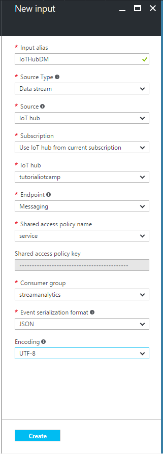
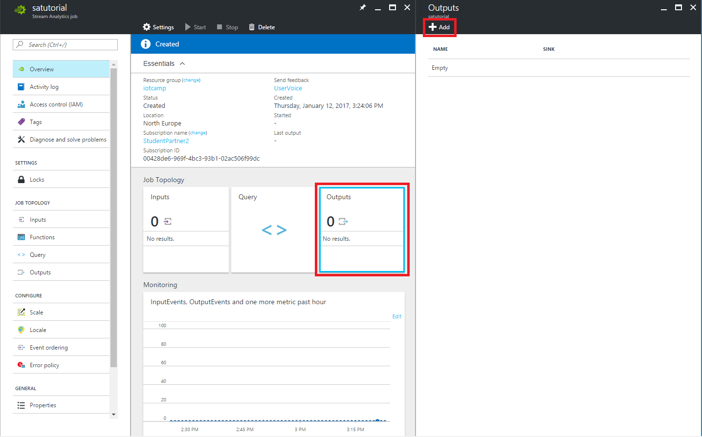
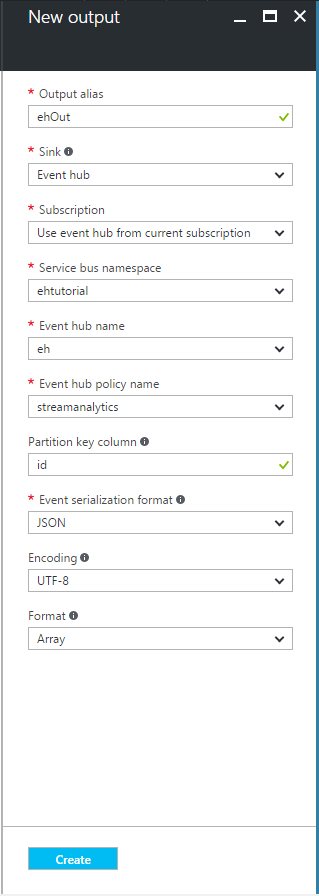

# CLOUD ARCHITECTURE (First version - Now it's moved [here](../FinalProjects/))

REQUIREMENTS: you must be logged in your Azure subscription

At the beginning you need to create all the following Azure resources:

* `Azure IotHub` ([official guide](https://docs.microsoft.com/en-us/azure/iot-hub/iot-hub-create-through-portal))
* `Azure StreamAnalytics` ([official guide](https://docs.microsoft.com/en-us/azure/stream-analytics/stream-analytics-create-a-job))
* `Azure WebApp` ([official guide](https://docs.microsoft.com/en-us/azure/app-service-web/app-service-web-how-to-create-a-web-app-in-an-ase))
    * to deploy the *dashboard*
* `Azure ApiApp` ([overview](https://docs.microsoft.com/en-us/azure/app-service-api/app-service-api-apps-why-best-platform) | [example](https://docs.microsoft.com/en-us/azure/app-service-api/app-service-api-dotnet-get-started))
    * to deploy the *registration api*
    * use the same App Service Plan (more info [here](https://docs.microsoft.com/en-us/azure/app-service/app-service-value-prop-what-is)) of the WebApp
* `Azure SQL Database`  ([official guide](https://docs.microsoft.com/en-us/azure/sql-database/sql-database-get-started)
                        | [create more servers](https://github.com/Microsoft/azure-docs/blob/master/articles/sql-database/sql-database-create-servers.md)
                        | [create more dbs](https://github.com/Microsoft/azure-docs/blob/master/articles/sql-database/sql-database-create-databases.md)
                        ) 
* `Azure EventHub` ([official guide](https://docs.microsoft.com/en-us/azure/event-hubs/event-hubs-csharp-ephcs-getstarted))
* `Azure ServiceBus Queue` ([official guide](https://docs.microsoft.com/en-us/azure/service-bus-messaging/service-bus-dotnet-get-started-with-queues#2-create-a-queue-using-the-azure-portal))
    * [here](https://docs.microsoft.com/en-us/azure/service-bus-messaging/service-bus-queues-topics-subscriptions) you can find a service overview


All resources must be in the same subscription and region. 

Now we're going to create the cloud infrastructure connecting our services.




## 1. Configure IoTHub 
We need to configure the **Messaging Endpoint** Consumer Group.

1. In the Azure portal, open your IoT hub and click on **Endpoints**.
2. Click on **Events** Endpoint.
    
    

3. Add **Consumer Group** for the StreamAnalytics named **streamanalytics**.

    


## 2. Configure EventHub
1. Add Shared Access Policies to the **EventHub's Namespace**
    * Go in the Namespace blade (not the specific Event Hub blade), click **Shared access policies**, and then click **Add**.

        

    * Create one access policy for the **dashboard** with the following features:
        * Name: webapp
        * Permissions: Listen
    
    * Create one access policy for the **StreamAnalytics** with the following features:
        * Name: streamanalytics
        * Permissions: Send

2. Add **Consumer Groups** to the EventHub
    * Go in the Event Hub specific blade, click **Consumer Group**, and then click **+ Consumer Group**.

        

    * Create two Consumer Groups
        * **local** for local testing environment
        * **website** for the production environment

    * You can find more information on Consumer Groups [here](https://docs.microsoft.com/en-us/azure/event-hubs/event-hubs-overview#consumer-groups)

## 3. Configure ServiceBus Queue
We now add Shared Access Policies to the ** ServiceBus Queue's Namespace**
1. Go in the Namespace blade (not the specific Event Hub blade), click **Shared access policies**, and then click **Add**.

    

2. Create one access policy for the **dashboard** with the following features:
    * Name: webjob
    * Permissions: Listen

3. Create one access policy for the **StreamAnalytics** with the following features:
    * Name: streamanalytics
    * Permissions: Send


## 4. Configure SQL Database
Now we're going to create the database structure.
We use EntityFramework as ORM (more info [here](https://msdn.microsoft.com/en-us/library/bb399567.aspx)).

1. Take note of the Database connection string, [here](https://docs.microsoft.com/en-us/azure/sql-database/sql-database-get-started#view-database-properties-in-the-azure-portal) is explained how to find it in the Azure portal.
2. Open the solution in VisualStudio and open **API** project.
3. Put your connection string in `Web.config` file

    ```
    <add name="Sensor2CloudContext" connectionString="<SQL DB ConnectionString>" providerName="System.Data.SqlClient" />
    ```
    
4. Restore **Nuget packages** of the project 
5. Open **Package Manager Console** in VisualStudio and run `Update-Database` (more info [here](https://www.asp.net/mvc/overview/getting-started/getting-started-with-ef-using-mvc/migrations-and-deployment-with-the-entity-framework-in-an-asp-net-mvc-application))

## 5. Configure StreamAnalytics



### Define input sources
1. You can click the created analytics job on the portal dashboard.

2. Click the **INPUTS** tab to define the source data.

3. Click **ADD**.

    

4. Enter *IoTHubDM* as **INPUT ALIAS**

5. Source Type is Data Stream

6. Source is *IotHub*.

7. IotHub name should be set to name you choose before.

8. IotHub policy name is, at least, *service*.

9. IotHub consumer group is *streamanalytics* (the one created before).

10. Select *JSON* for **EVENT SERIALIZATION FORMAT** and *UTF8* for **ENCODING**.

    

    Click Create to finish the wizard. Now all inputs are defined.


### Define outputs
1. On the Stream Analytics job overview pane, select OUTPUTS.

2. Click Add.

    

3. Add EventHub
    * Set the Output alias to *'ehOut'* and then Sink to EventHub.
    * Select the ServiceBus Namespace and the EventHub name that you created earlier.
    * Use *'id'* as Partition key column. This is because messages processed by the StreamAnalytics Job have a field called *id* that identify the device. (Look at the query above and [here](https://docs.microsoft.com/en-us/azure/event-hubs/event-hubs-overview#partitions) for more info about partitioning)
    * Select *JSON* for **EVENT SERIALIZATION FORMAT**, *UTF-8* for **ENCODING** and *Array* for **Format**.
    * Click Create to finish the wizard.

    

4. Add ServiceBus Queue
    * Set the Output alias to *'Queue'* and then Sink to Service bus Queue.
    * Select the ServiceBus name and the Queue name that you created earlier.
    * Select *JSON* for **EVENT SERIALIZATION FORMAT**, *UTF-8* for **ENCODING** and *Array* for **Format**.
    * Click Create to finish the wizard.

    

5. Add SQL Database
    * Set the Output alias to 'SQL' and then Sink to SQL database.
    * Select the server name that was created earlier.
    * Enter USERNAME and PASSWORD fields that was chosen before.
    * Enter *'Devices'* as the TABLE field.
    * Click Create to finish the wizard.

    

Now all outputs are defined.

### Query
First of all we need to remember the format of the messages we receive from devices:

```javascript
{
    "id": "Device MAC address",
    "name": "Device name",
    "ts": "UTC Timestamp ",
    "temp": "temperature",
    "hum": "humidity",
    "accX": "accelerometer x",
    "accY": "accelerometer y",
    "accZ": "accelerometer z",
    "gyrX": "gyroscope x",
    "gyrY": "gyroscope y",
    "gyrZ": "gyroscope z"
}
```

You can find the final query below or [here](../Utilities/StreamAnalyticsQuery.sql).

Documentation on Azure StreamAnalytics Query Language [here](https://msdn.microsoft.com/en-us/library/azure/dn834998.aspx).

```sql
-- IoTHubDM -> StreamAnalytics -> Service Bus Queue (Queue)
--                             -> Event Hub (ehOut)
--                             -> SQL Azure (SQL )


WITH NormalizedData AS (
    SELECT IoTHub.ConnectionDeviceId AS id, name, ts, temp, hum, accX, accY, accZ, gyrX, gyrY, gyrZ
    FROM IoTHubDM
)

-- Send messages to web app
-- Every output message is the mean of the messages received in the tumbling window
SELECT id, name, System.Timestamp AS ts, AVG(temp) AS temp, AVG(hum) AS hum, AVG(accX) AS accX, AVG(accY) AS accY, AVG(accZ) AS accZ, AVG(gyrX) AS gyrX, AVG(gyrY) AS gyrY, AVG(gyrZ) AS gyrZ, 'ins' AS mtype
INTO ehOut
FROM NormalizedData PARTITION BY id
GROUP BY id, name, TumblingWindow(second, 2)


-- Count the number of messages sent by each device every day and save it in a SQL database
SELECT IoTHub.ConnectionDeviceId AS MacAddress, System.Timestamp AS Timestamp, COUNT(*) AS MessagesCount
INTO SQL
FROM IoTHubDM
GROUP BY IoTHub.ConnectionDeviceId, TumblingWindow(day, 1)


-- Count the number of messages sent by each device every X minutes and put these info to a message in a queue
-- Those messages will be read by a web job that eventually change the status of every device (enabled/disabled/warning)
-- If you want to put the message only if the number of messages is over a threshold add "HAVING MessagesCount > Y" at the end
SELECT IoTHub.ConnectionDeviceId AS MacAddress, System.Timestamp AS Timestamp, COUNT(*) AS MessagesCount
INTO Queue
FROM IoTHubDM
GROUP BY IoTHub.ConnectionDeviceId, TumblingWindow(second, 60)
```


You can find another example [here]https://docs.microsoft.com/en-us/azure/stream-analytics/stream-analytics-build-an-iot-solution-using-stream-analytics).

## 6. Start services
Now we are ready to start the services.

In the Azure portal, open your Azure StreamAnalytics blade and click on **start** ([official guide](https://docs.microsoft.com/en-us/azure/stream-analytics/stream-analytics-run-a-job)).
