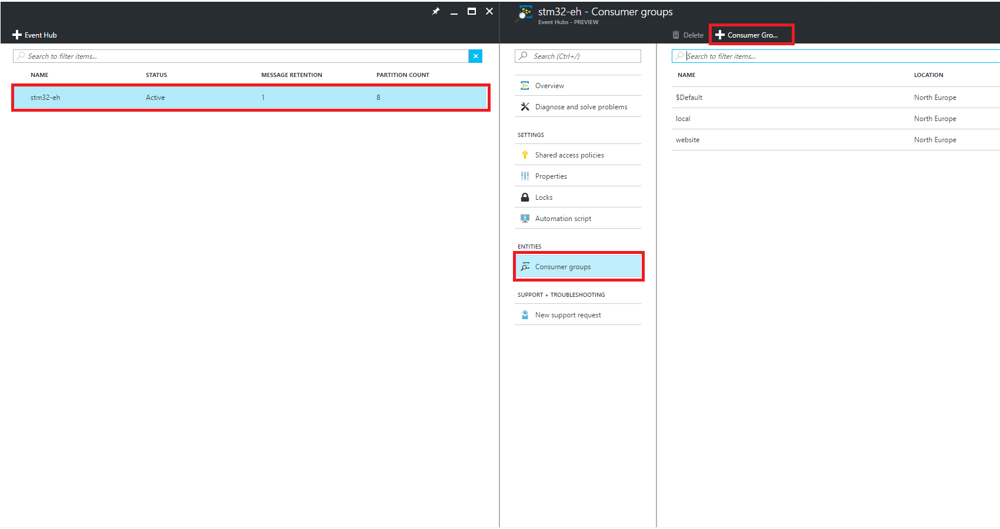
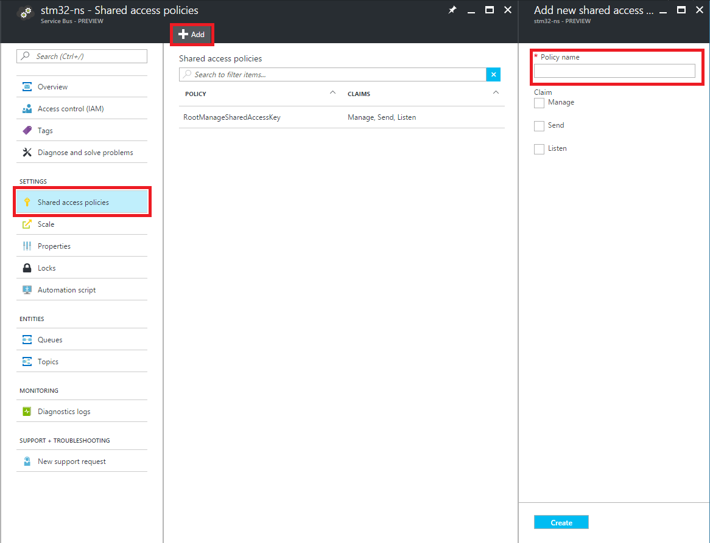
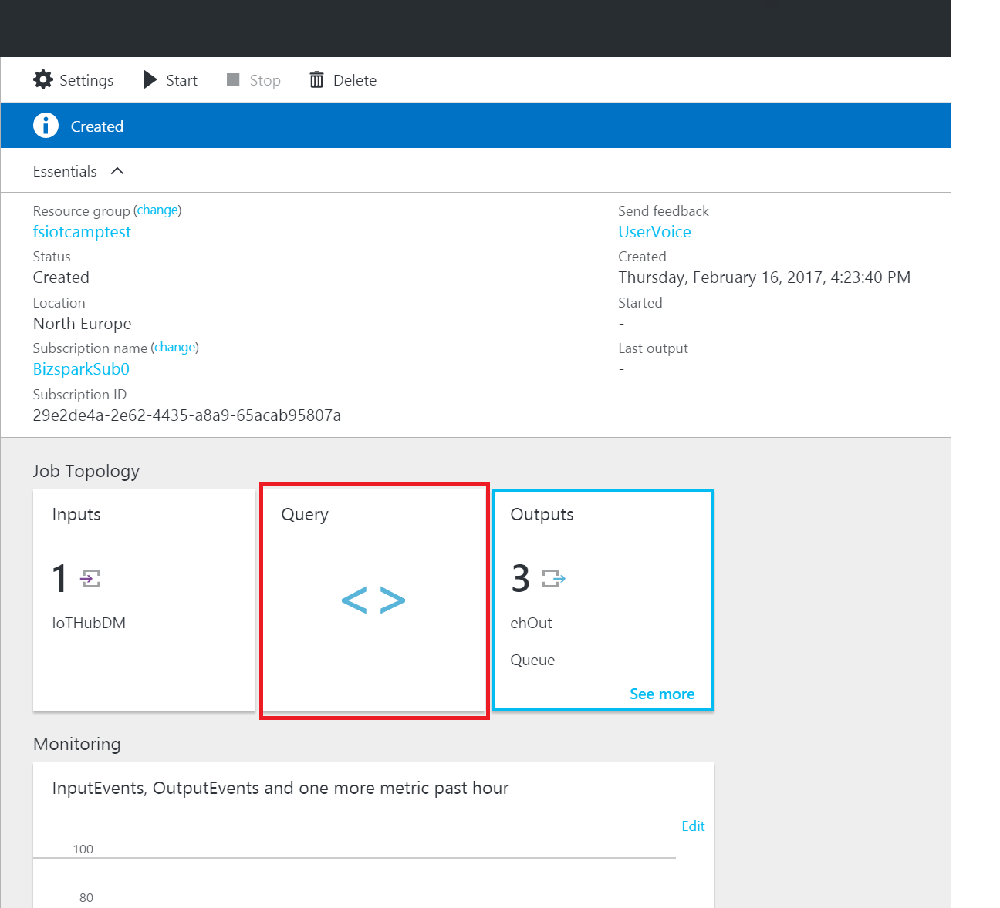

# Create the Azure services and configure the web application.

First of we are going to create the Azure architecture:

* Login in the [Azure Portal](https://portal.azure.com) 
* Follow the instructions below ([CLOUD ARCHITECTURE](#cloud-architecture) and [PROJECTS CONFIGURATION](#projects-configuration))

# CLOUD ARCHITECTURE

REQUIREMENTS: you must be logged in your Azure subscription

Create the following Azure resources:

* `Azure Iot Hub` ([official guide](https://docs.microsoft.com/en-us/azure/iot-hub/iot-hub-create-through-portal))
* `Azure Stream Analytics` ([official guide](https://docs.microsoft.com/en-us/azure/stream-analytics/stream-analytics-create-a-job))
* `Azure Web App` ([official guide](https://docs.microsoft.com/en-us/azure/app-service-web/app-service-web-how-to-create-a-web-app-in-an-ase))
    * to deploy the *dashboard*
    * enable *'WEB SOCKETS'* and *'ALWAYS ON'* from ApplicationSettings (more details [here](https://docs.microsoft.com/en-us/azure/app-service-web/web-sites-configure))
* `Azure Api App` ([overview](https://docs.microsoft.com/en-us/azure/app-service-api/app-service-api-apps-why-best-platform) | [example](https://docs.microsoft.com/en-us/azure/app-service-api/app-service-api-dotnet-get-started))
    * to deploy the *registration api*
    * enable *'ALWAYS ON'* from ApplicationSettings (more details [here](https://docs.microsoft.com/en-us/azure/app-service-web/web-sites-configure))
    * use the same App Service Plan (more info [here](https://docs.microsoft.com/en-us/azure/app-service/app-service-value-prop-what-is)) of the previously created WebApp
* `Azure SQL Database`  ([official guide](https://docs.microsoft.com/en-us/azure/sql-database/sql-database-get-started)
                        | [create more servers](https://github.com/Microsoft/azure-docs/blob/master/articles/sql-database/sql-database-create-servers.md)
                        | [create more dbs](https://github.com/Microsoft/azure-docs/blob/master/articles/sql-database/sql-database-create-databases.md)
                        ) 
* `Azure Event Hub` ([official guide](https://docs.microsoft.com/en-us/azure/event-hubs/event-hubs-create))
* `Azure Service Bus namespace and queue` ([namespace](https://docs.microsoft.com/en-us/azure/service-bus-messaging/service-bus-dotnet-get-started-with-queues#1-create-a-namespace-using-the-azure-portal) | [queue](https://docs.microsoft.com/en-us/azure/service-bus-messaging/service-bus-dotnet-get-started-with-queues#2-create-a-queue-using-the-azure-portal))
    * [here](https://docs.microsoft.com/en-us/azure/service-bus-messaging/service-bus-queues-topics-subscriptions) you can find a service overview
* `Azure Storage Account` ([official guide](https://docs.microsoft.com/en-us/azure/storage/storage-create-storage-account))


**NOTE: All resources must be in the same subscription and region.** 

Now we're going to create the cloud infrastructure connecting our services as shown in the figures below.


## 1. Configure IoTHub 
We need to configure the **Messaging Endpoint** Consumer Group.

1. In the Azure portal, open your IoT hub and click on **Endpoints**.
2. Click on **Events** Endpoint.
    
    

3. Add **Consumer Group** for the StreamAnalytics named **streamanalytics**.
StreamAnalytics will use this consumer group to connect to the Iot Hub.

    


## 2. Configure EventHub
1. Add Shared Access Policies to the **EventHub's Namespace**.
Each Shared Access Policies can have one or more permissions associated:

    * Send: send data to Event Hub
    * Listen: read data from Event Hub
    * Manage: manage Event Hub

Azure generate automatically two keys for each Shared Access Policy.
These keys can be used by the services that want to talk with the Event Hub.
For example, the services that must send data to the Event Hub must use a Shared Access Policy with at least Send permissions. 

    * Go in the Namespace blade (not the specific Event Hub blade), click **Shared access policies**, and then click **Add**.

        

    * Create one access policy for the **dashboard** with the following features:
        * Name: webapp
        * Permissions: Listen
    
    * Create one access policy for the **StreamAnalytics** with the following features:
        * Name: streamanalytics
        * Permissions: Send

2. Add [**Consumer Groups**](https://docs.microsoft.com/en-us/azure/event-hubs/event-hubs-overview#consumer-groups) to the EventHub
    * Go in the Event Hub specific blade, click **Consumer Group**, and then click **+ Consumer Group**.

        

    * Create two Consumer Groups
        * **local** for local testing environment
        * **website** for the production environment

## 3. Configure ServiceBus Queue
We now add Shared Access Policies to the ** ServiceBus Queue's Namespace**   
1. Go in the Namespace blade (not the specific Event Hub blade), click **Shared access policies**, and then click **Add**.

    

2. Create one access policy for the **dashboard** with the following features:
    * Name: webjob
    * Permissions: Listen

3. Create one access policy for the **StreamAnalytics** with the following features:
    * Name: streamanalytics
    * Permissions: Send


## 4. Configure SQL Database
Now we're going to create the database structure.
We use Entity Framework as ORM (more info [here](https://msdn.microsoft.com/en-us/library/bb399567.aspx)).

1. Take note of the Database connection string, [here](https://docs.microsoft.com/en-us/azure/sql-database/sql-database-get-started#view-database-properties-in-the-azure-portal) is explained how to find it in the Azure portal.
2. Open the solution in Visual Studio and open **API** project.
3. Put your connection string in `Web.config` file

    ```
    <add name="Sensor2CloudContext" connectionString="[SQL DB CONNECTIONSTRING]" providerName="System.Data.SqlClient" />
    ```
    
4. Restore **Nuget packages** of the project 
5. Right click to the **API** project and click **Set as startup project**
5. Open **Package Manager Console** in Visual Studio, select the API project from the dropdown list and run `Update-Database` (more info [here](https://www.asp.net/mvc/overview/getting-started/getting-started-with-ef-using-mvc/migrations-and-deployment-with-the-entity-framework-in-an-asp-net-mvc-application))

## 5. Configure Stream Analytics


### Define input sources
1. You can click the created analytics job on the portal dashboard.

2. Click the **INPUTS** tab to define the source data.

3. Click **ADD**.

    

4. Enter *IoTHubDM* as **INPUT ALIAS**

5. Source Type is Data Stream

6. Source is *IotHub*.

7. IotHub name should be set to name you choose before.

8. IotHub policy name is, at least, *service*.

9. IotHub consumer group is *streamanalytics* (the one created before).

10. Select *JSON* for **EVENT SERIALIZATION FORMAT** and *UTF8* for **ENCODING**.

    

    Click Create to finish the wizard. Now all inputs are defined.


### Define outputs
1. On the Stream Analytics job overview pane, select OUTPUTS.

2. Click Add.

    

3. Add Event Hub
    * Set the Output alias to *'ehOut'* and then Sink to EventHub.
    * Select the Service Bus Namespace and the Event Hub name that you created earlier.
    * Use *'id'* as Partition key column. This is because messages processed by the Stream Analytics Job have a field called *id* that identify the device. (Look at the query above and [here](https://docs.microsoft.com/en-us/azure/event-hubs/event-hubs-overview#partitions) for more info about partitioning)
    * Select *JSON* for **EVENT SERIALIZATION FORMAT**, *UTF-8* for **ENCODING** and *Array* for **Format**.
    * Click Create to finish the wizard.

    

4. Add Service Bus Queue
    * Set the Output alias to *'Queue'* and then Sink to Service Bus Queue.
    * Select the Service Bus name and the Queue name that you created earlier.
    * Select *JSON* for **EVENT SERIALIZATION FORMAT**, *UTF-8* for **ENCODING** and *Array* for **Format**.
    * Click Create to finish the wizard.

    

5. Add SQL Database
    * Set the Output alias to 'SQL' and then Sink to SQL database.
    * Select the server name that was created earlier.
    * Enter USERNAME and PASSWORD fields that was chosen before.
    * Enter *'Devices'* as the TABLE field.
    * Click Create to finish the wizard.

    

Now all outputs are defined.

### Define query
First of all we need to remember the format of the messages we receive from devices:

```javascript
{
    "id": "Device MAC address",
    "name": "Device name",
    "ts": "UTC Timestamp ",
    "temp": "temperature",
    "hum": "humidity",
    "accX": "accelerometer x",
    "accY": "accelerometer y",
    "accZ": "accelerometer z",
    "gyrX": "gyroscope x",
    "gyrY": "gyroscope y",
    "gyrZ": "gyroscope z"
}
```

Al these messages are sent from the IoT Hub to the Stream Analytics that will process them according to the following query:


```sql
-- IoTHubDM -> StreamAnalytics -> Service Bus Queue (Queue)
--                             -> Event Hub (ehOut)
--                             -> SQL Azure (SQL )


WITH NormalizedData AS (
    SELECT IoTHub.ConnectionDeviceId AS id, name, ts, temp, hum, accX, accY, accZ, gyrX, gyrY, gyrZ
    FROM IoTHubDM
)

-- Send messages to web app
-- Every output message is the mean of the messages received in the tumbling window
SELECT id, name, System.Timestamp AS ts, AVG(temp) AS temp, AVG(hum) AS hum, AVG(accX) AS accX, AVG(accY) AS accY, AVG(accZ) AS accZ, AVG(gyrX) AS gyrX, AVG(gyrY) AS gyrY, AVG(gyrZ) AS gyrZ, 'ins' AS mtype
INTO ehOut
FROM NormalizedData PARTITION BY id
GROUP BY id, name, TumblingWindow(second, 2)


-- Count the number of messages sent by each device every day and save it in a SQL database
SELECT IoTHub.ConnectionDeviceId AS MacAddress, System.Timestamp AS Timestamp, COUNT(*) AS MessagesCount
INTO SQL
FROM IoTHubDM
GROUP BY IoTHub.ConnectionDeviceId, TumblingWindow(day, 1)


-- Count the number of messages sent by each device every X minutes and put these info to a message in a queue
-- Those messages will be read by a web job that eventually change the status of every device (enabled/disabled/warning)
-- If you want to put the message only if the number of messages is over a threshold add "HAVING MessagesCount > Y" at the end
SELECT IoTHub.ConnectionDeviceId AS MacAddress, System.Timestamp AS Timestamp, COUNT(*) AS MessagesCount
INTO Queue
FROM IoTHubDM
GROUP BY IoTHub.ConnectionDeviceId, TumblingWindow(second, 60)
```

Set the query:

1. Select QUERY to the Stream Analytics panel

    

2. Copy and paste the query to the new panel and click *Save*

    


**More info about Azure Stream Analytics Query Language [here](https://msdn.microsoft.com/en-us/library/azure/dn834998.aspx).**

You can find another usefull example [here](https://docs.microsoft.com/en-us/azure/stream-analytics/stream-analytics-build-an-iot-solution-using-stream-analytics).

### Start Stream Analytics

In the Azure portal, open your Azure Stream Analytics blade and click on **Start** button ([official guide](https://docs.microsoft.com/en-us/azure/stream-analytics/stream-analytics-run-a-job)).


## 6. Create Cognitive Services API KEYS

In this task, you will sign up for the BING SPEECH and LUIS analytics service.

1. Click **New** button and search *Cognitive Services APIs* in the Azure Portal.
2. Click *Create*.
3. Ensure *Bing Speech API* is selected as the 'API type'
4. Select a plan. 
5. Complete the other fields and create your account.
6. Find your API Key. Copy the primary key, as you will need it when using the API services.

Repeat the same steps to create *Language Understanding Intelligent Service (LUIS) API*.

Now you can train your language model at [www.luis.ai/](https://www.luis.ai/).   
The goal is to train LUIS to underastand phrases and translate it in intents.   
Those intents will be sent as commands to the STM32 device.

We need to understand at least 2 intents:
* *' led on '*
* *' led off '*

so let's train the model with some italian phrases that should pass that intentions.


Follow [this](https://www.microsoft.com/cognitive-services/en-us/LUIS-api/documentation/GetStartedWithLUIS-Basics) link for further details.

# PROJECTS CONFIGURATION
Now its time to configure and publish the ASP.NET web application to Azure Web App service.

## 1. [Sensor2Cloud-Dashboard](Sensor2Cloud-Dashboard)   

This projects show a website where the data coming from the device are shown in some graphs.

### Setup AppSettings and ConnectionStrings

Insert AppSettings and ConnectionStrings in the `Web.config` file of the project.   
You can find the values in the settings blade of each previously created service under *Key* option.

```xml
<appSettings>
    <add key="Microsoft.ServiceBus.EventHubDevices" value="[EVENTHUB NAME]" />
    <add key="Microsoft.ServiceBus.EventHubDevices.PartitionCount" value="[EVENTHUB PARTITION COUNT]" />
    <add key="Microsoft.ServiceBus.EventHubDevices.ConsumerGroup" value="[EVENTHUB PRODUCTION CONSUMER GROUP]" />
    <add key="API.URL" value="[API URL]" />
    <add key="BING_SPEECH_API_KEY" value="[BING SPEECH API KEY]" />
    <add key="LUIS_APP_ID" value="[LUIS APP ID]" />
    <add key="LUIS_SUBSCRIPTION_ID" value="[LUIS SUBSCRIPTION ID]" />
</appSettings>
<connectionStrings>
    <add name="Microsoft.Azure.IoTHub.ConnectionString.Service" connectionString="[IOT HUB CONNECTION STRING]" />
    <add name="Microsoft.ServiceBus.ConnectionStringDevices" connectionString="[EVENTHUB CONNECTION STRING]" />
</connectionStrings>

```

Put your application insights instrumental key in the `ApplicationInsights.config` file

```xml
<InstrumentationKey>Your Application Insights key</InstrumentationKey>
```

### Test

Run in Visual Studio.


### Publish

[Deploy](https://docs.microsoft.com/en-us/azure/app-service-web/web-sites-dotnet-get-started#deploy-the-web-project-to-azure) this project in the Azure Web App created before, using Visual Studio.


## 2. [API](API)  

This project expose web services for devices management.

### Setup ConnectionStrings

Put your connection strings in the `Web.config` file of the project:

```xml
<add name="Sensor2CloudContext" connectionString="[SQL DB CONNECTION STRING]" providerName="System.Data.SqlClient" />
<add name="Microsoft.Azure.IoTHub.ConnectionString.Service" connectionString="[IOT HUB CONNECTION STRING]" />
```

Put your application insights instrumental key in the `ApplicationInsights.config` file

```xml
<InstrumentationKey>Your Application Insights key</InstrumentationKey>
```

### Test

Run in Visual Studio and open Swagger UI (/swagger) to test your APIs. More info on Swagger [here](https://docs.microsoft.com/en-us/azure/app-service-api/app-service-api-dotnet-get-started#use-swagger-api-metadata-and-ui).


### Publish
[Deploy](https://docs.microsoft.com/en-us/azure/app-service-web/web-sites-dotnet-get-started#deploy-the-web-project-to-azure) this project in the Azure API App created before, using Visual Studio.


## 3. [WebJob-NotifyDevices](WebJob-NotifyDevices)  


### Setup AppSettings and ConnectionStrings
Put your connection strings in the `App.config` file:

```xml
<connectionStrings>
    <add name="AzureWebJobsDashboard" connectionString="<Storage account connection string>" />
    <add name="AzureWebJobsStorage" connectionString="<Storage account connection string>" />
    <add name="AzureWebJobsServiceBus" connectionString="<ServiceBus account connection string>" />
    <add name="Microsoft.Azure.IoTHub.ConnectionString.Service" connectionString="<IotHub account connection string>" /> 
</connectionStrings>

```  

Update the app setting in the `App.config` file:

```xml
<appSettings>
    <add key="queueName" value="[QUEUE NAME]" />
    <add key="threshold" value="[THRESHOLD]"/>
    <add key="Dashboard.URL" value="[DASHBOARD URL]"/>
</appSettings>
```


### Test

Run in VisualStudio and add message to the queue to trigger the functions. 

To add test message to the queue you can create a console application like [this](https://docs.microsoft.com/en-us/azure/service-bus-messaging/service-bus-java-how-to-use-queues#send-messages-to-a-queue).

### Publish
[Deploy](https://docs.microsoft.com/en-us/azure/app-service-web/websites-dotnet-deploy-webjobs#a-iddeployadeploy-a-webjobs-project) this project as a continuous Azure WebJob in the Azure API App created before, using Visual Studio.


## 4. [WebJob-EnableDevices](WebJob-EnableDevices)

### Setup ConnectionStrings

Put your connection strings in the `App.config` file:

```xml
<connectionStrings>
    <add name="AzureWebJobsDashboard" connectionString="<Storage account connection string>" />
    <add name="AzureWebJobsStorage" connectionString="<Storage account connection string>" />
    <add name="Microsoft.Azure.IoTHub.ConnectionString.Service" connectionString="<IotHub account connection string>" />
</connectionStrings>

```  

### Test

You can run this WebJob in Visual Studio.


### Publish
[Deploy](https://docs.microsoft.com/en-us/azure/app-service-web/websites-dotnet-deploy-webjobs#a-iddeployadeploy-a-webjobs-project) this project a continuous Azure WebJob in the Azure API App created before, using Visual Studio.


## SETUP APPSETTINGS IN THE AZURE PORTAL 

If you want, you can override your AppSettings and ConnectionString through the Azure Portal. 

More details [here](https://azure.microsoft.com/en-us/blog/windows-azure-web-sites-how-application-strings-and-connection-strings-work/) and [here](https://docs.microsoft.com/en-us/azure/app-service-web/web-sites-configure).
